## How do I upload my model to the "Downloadable Models" menu?

If you are not aware already, Aimmy contains a "Downloadable Models" tab that allows you to download models developed and shared by the Aimmy Community.

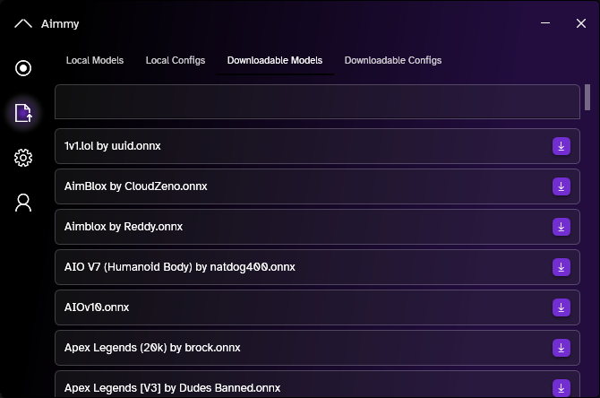

Aimmy pulls these models from the [Aimmy repository](https://github.com/Babyhamsta/Aimmy/tree/master/models), this means **anyone can upload models to the "Downloadable Models" tab by making a pull request**.

To start, please note that if you would like to be credited for your work, name your model as:
**[Game Name/Model Name]** by **[The Creator]**

If you would like to stay anonymous however, you may only list the Game Name/Model Name.

Now, fork the Aimmy Repository
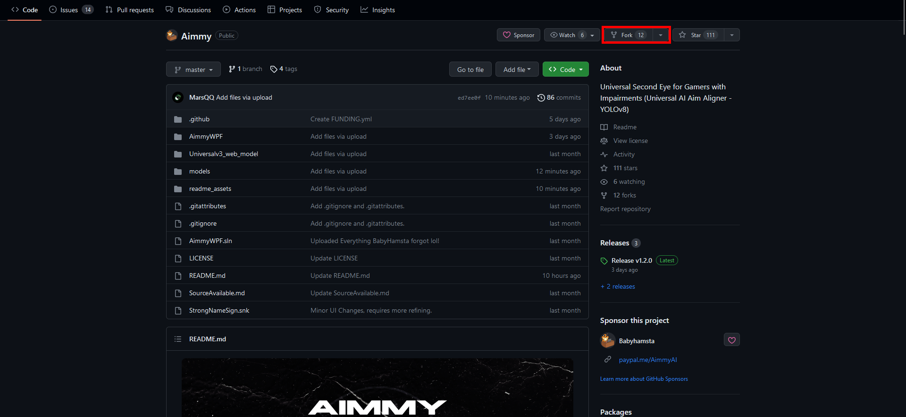
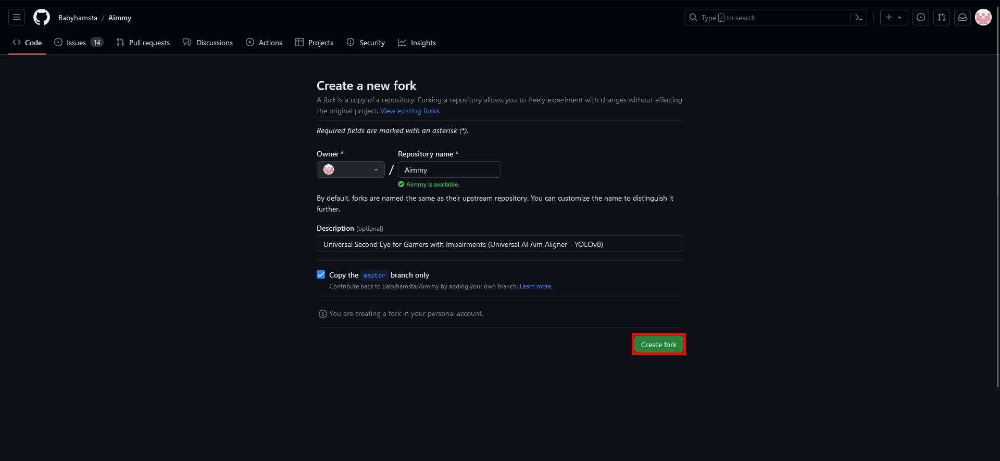

After that, go to your fork's model folder
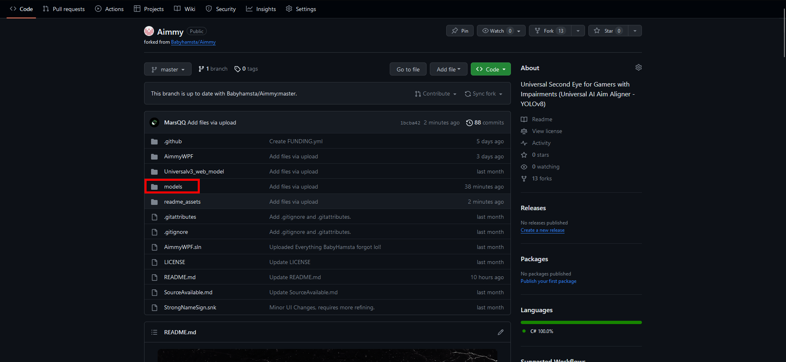

Press "Add File"
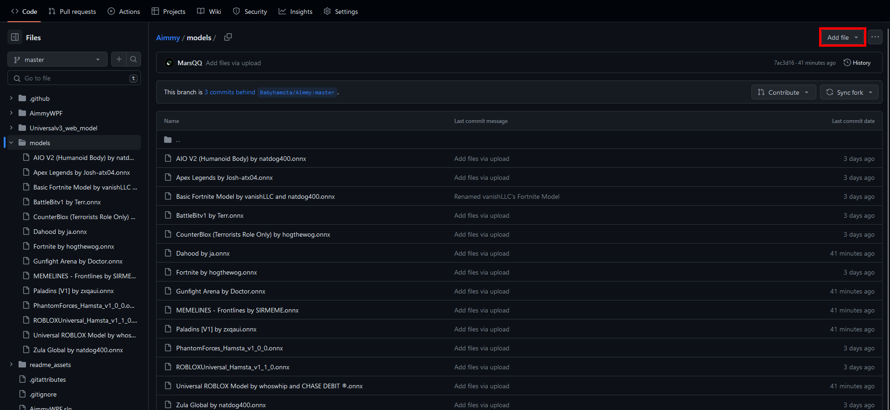

Drag your model onto the area that contains the text "Drag additional files here to add them to your repository"
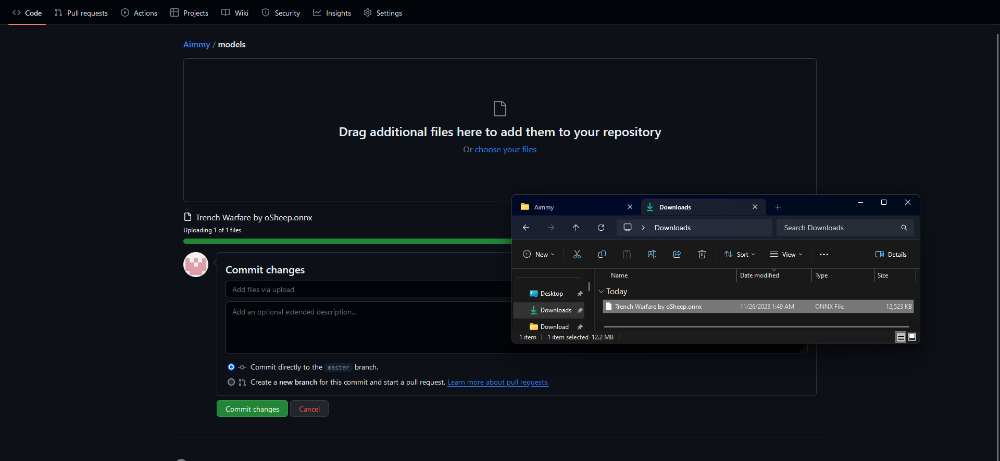

and press "Commit Changes" when the green progress bar disappears
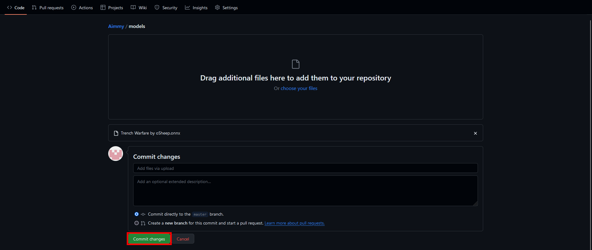

Now go to the "Pull requests" tab
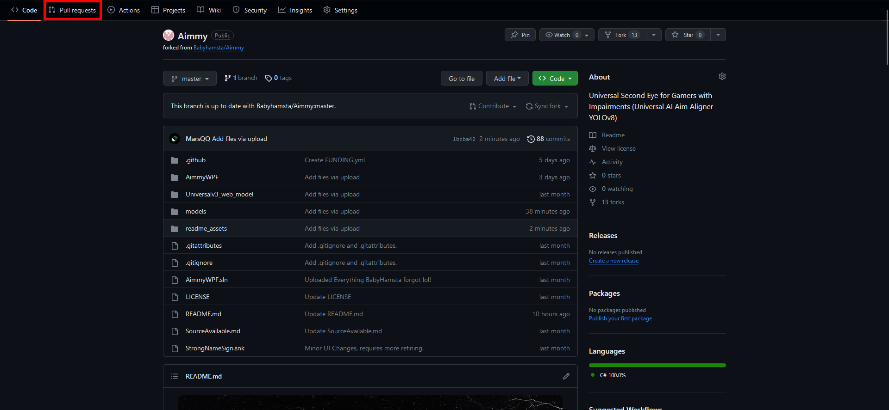

Create a new pull request
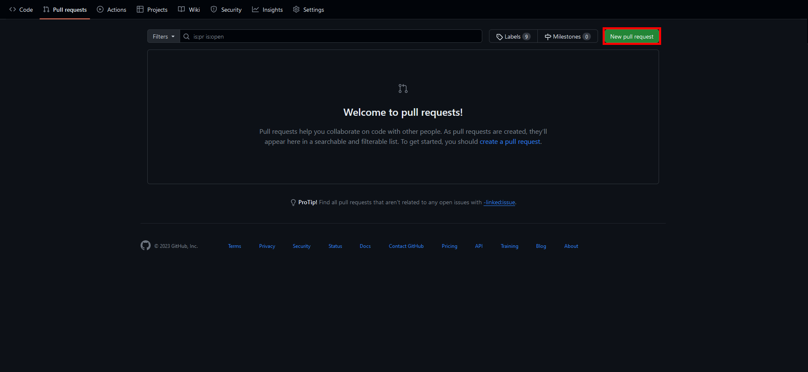

Create the pull request
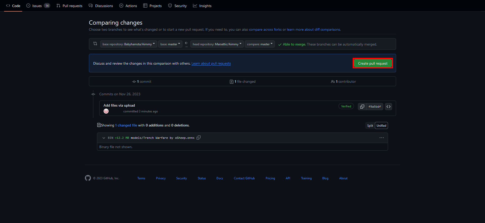

Create the pull request (again)
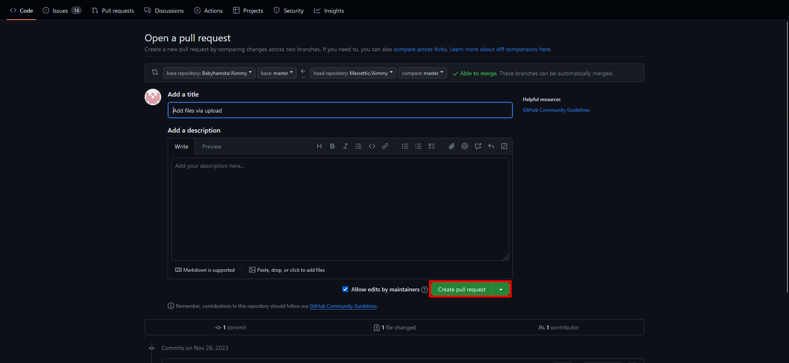

You are done! We will review your pull request and your model will be added in 24-48 hours. If you would like to remove your model from the "Downloadable Models" tab, you may make another pull request or contact us on the Issues tab.

For anyone who does this, thank you so much =D, Aimmy genuinely thrives with community contributions and support, and making and sharing your Aimmy models genuinely means a lot to us! Thank you!
